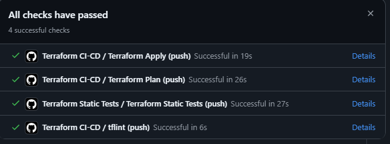
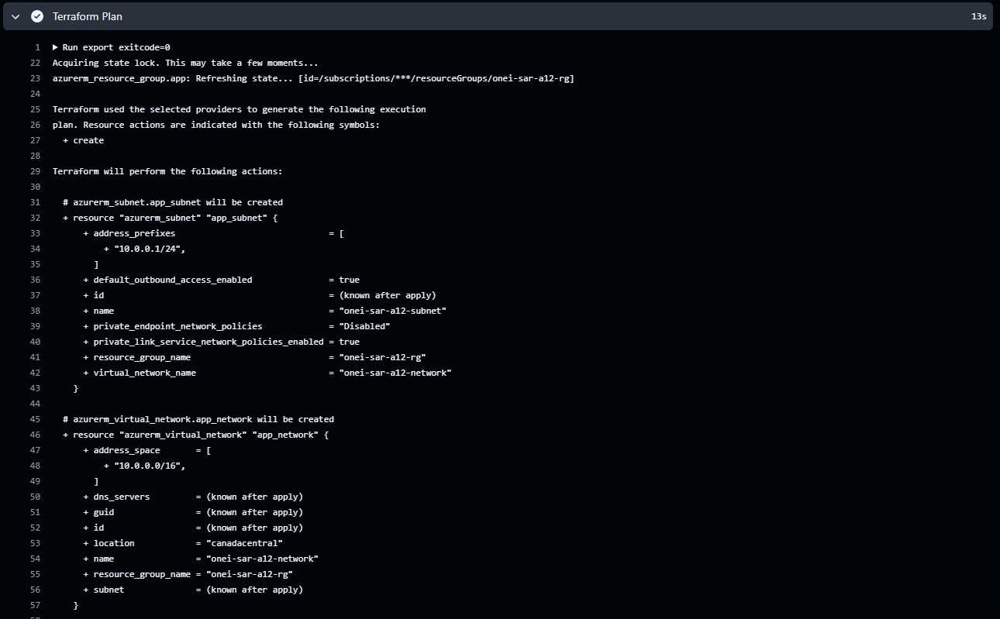
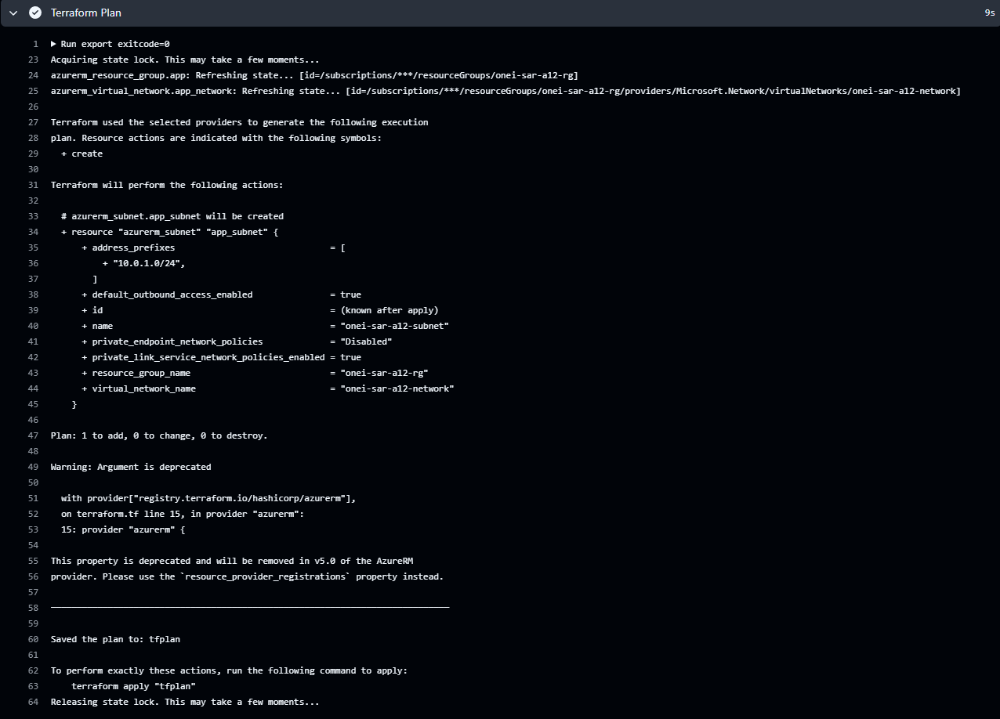
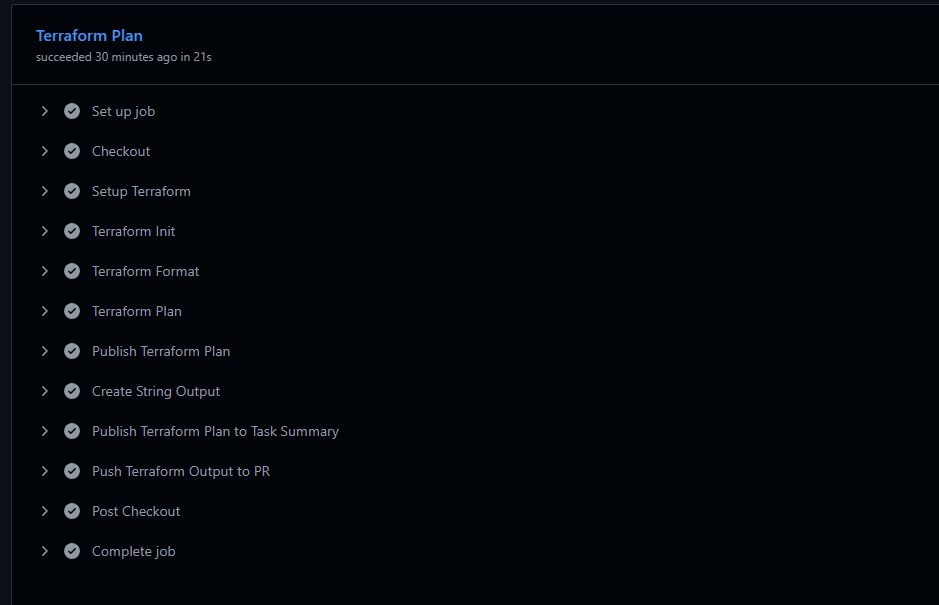
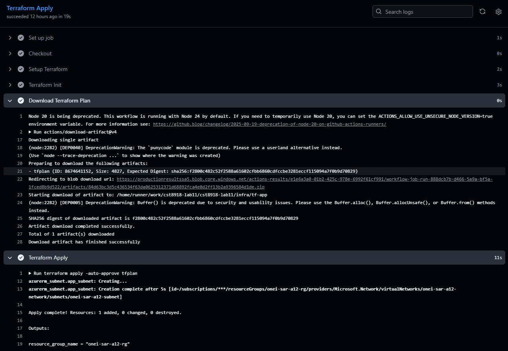

# CST8918 – Lab 11
## Infrastructure as Code CI/CD Pipeline with Terraform and GitHub Actions

**Course:** CST8918 – Infrastructure as Code  
**Semester:** Summer 2026

---

# Team Members

| Name | GitHub Username |
|------|-----------------|
| Todd O'Neil | Todd-Oneil-CloudDev |
| Sara Mirzaei | saraMir26 |

---

# Lab Overview

The objective of this lab was to build a complete Continuous Integration and Continuous Deployment (CI/CD) pipeline for Terraform using GitHub Actions and Microsoft Azure.

The pipeline automates infrastructure validation, planning, deployment, and drift detection while securely authenticating to Azure using GitHub OpenID Connect (OIDC) instead of storing Azure credentials.

---

# Technologies Used

- Terraform
- GitHub Actions
- Microsoft Azure
- Azure Storage Account
- Azure Resource Group
- Azure OpenID Connect (OIDC)
- TFLint
- GitHub Issues

---

# Lab Implementation

---

# Step 1 – Repository Setup

A shared GitHub repository was created for the team to collaborate on the Terraform infrastructure.

Git branching and Pull Request workflows were used throughout the lab to ensure that every change was reviewed before being merged into the main branch.

---

# Step 2 – Terraform Remote Backend

A Terraform remote backend was configured in Azure.

The backend consists of:

- Azure Resource Group
- Azure Storage Account
- Private Blob Container

Terraform state files are stored remotely, allowing both team members to collaborate safely without local state conflicts.

A backend configuration file (`prod.backend.hcl`) was created so the backend settings remain separate from the Terraform configuration.

---

# Step 3 – Azure Authentication (OIDC)

GitHub Actions was configured to authenticate with Azure using OpenID Connect (OIDC).

Instead of storing Azure credentials inside GitHub Secrets, the workflow exchanges a temporary identity token with Microsoft Entra ID.

Repository secrets used:

- AZURE_CLIENT_ID
- AZURE_TENANT_ID
- AZURE_SUBSCRIPTION_ID
- ARM_ACCESS_KEY

GitHub Environments were also configured for production deployment approval.

---

# Step 4 – Terraform Static Tests

A GitHub Actions workflow was created to validate the Terraform configuration whenever code is pushed.

The workflow performs:

- Terraform Init (without backend)
- Terraform Validate
- Terraform Format Check
- TFLint Static Analysis

These checks ensure Terraform code quality before integration.

---

# Step 5 – Terraform Integration (Plan)

The CI workflow was extended to generate a Terraform execution plan.

The workflow performs:

- Azure authentication using OIDC
- Terraform backend initialization
- Terraform Plan
- Upload Terraform Plan as an artifact
- Publish Terraform Plan inside the Pull Request

This allows reviewers to verify infrastructure changes before deployment.

---

# Step 6 – Terraform Deployment (Apply)

The CI/CD pipeline was extended with a deployment stage.

Deployment only occurs when:

- The Pull Request is approved
- The Pull Request is merged into the **main** branch
- Terraform detects infrastructure changes

The deployment workflow:

- Downloads the previously generated Terraform Plan
- Uses the Production GitHub Environment
- Applies the Terraform Plan to Azure

This ensures that the deployed infrastructure exactly matches the reviewed execution plan.

---

# Step 7 – Terraform Drift Detection

A scheduled GitHub Actions workflow was created to detect infrastructure drift.

The workflow:

- Executes Terraform Plan against Azure
- Detects infrastructure changes made outside Terraform
- Automatically creates or updates a GitHub Issue when drift is detected
- Automatically closes the issue after the drift has been resolved

This helps maintain consistency between the deployed infrastructure and the Terraform configuration.

---
  
# Team Contribution

## Todd O'Neil

Completed:

- Terraform backend infrastructure
- Azure App Registration
- GitHub OIDC Federated Credentials
- Azure environment configuration
- Pull Request reviews
- Repository management
- Drift Detection implementation support


## Sara Mirzaei

Completed:

- Terraform Static Testing workflow
- Terraform Integration workflow
- Terraform Deployment workflow
- GitHub Actions debugging
- Terraform backend configuration updates
- Pull Request reviews

---

# Challenges Encountered

Several issues were encountered during implementation.

## GitHub OIDC Changes

During development GitHub introduced a new OpenID Connect identity subject format.

This caused authentication failures because the Azure Federated Credentials no longer matched the identity presented by GitHub Actions.

The Azure App Registration was updated to support the new GitHub identity format.

---

## Terraform Backend Configuration

The Terraform workflows originally failed because the backend configuration file was not referenced during initialization.

The workflows were updated to initialize Terraform using:

```text
terraform init -backend-config=../tf-backend/prod.backend.hcl
```

---

## TFLint Validation

Several TFLint warnings were resolved including:

- unused Terraform variables
- Terraform formatting
- comment syntax
- undocumented outputs

---

## Merge Conflicts

Multiple feature branches were merged during development.

Conflicts were resolved while preserving both team members' contributions.

---

# Screenshots

## Pull Request Checks



---

## Terraform Plan Output
A typo was found in the intial configuration of the subt net. the following 2 screenshots sums up the terraform plan. The initial Virtual network was created and the subnet failed. After fixing the issue the pipeline then created only the subnet.

### Virtual Network With Failed Subnet


### Subnet Creation


### Full Plan Success Pipeline

---

## Terraform Apply Workflow



---

## Drift Detection Workflow


---

# Repository Structure

```text
.github/
    workflows/
        infra-static-tests.yml
        infra-ci-cd.yml
        infra-drift-detection.yml

infra/
    tf-app/
    tf-backend/

README.md
```

---

# Lessons Learned

This lab provided practical experience implementing Infrastructure as Code using industry-standard DevOps practices.

Key concepts learned include:

- GitHub Actions workflows
- Pull Request validation
- Infrastructure deployment using Terraform
- Azure remote backend configuration
- GitHub OpenID Connect authenticationgit
- Continuous Integration
- Continuous Deployment
- Infrastructure Drift Detection
- Team collaboration using GitHub

---

# Conclusion

This lab successfully implemented a complete Infrastructure as Code CI/CD pipeline using Terraform, GitHub Actions, and Microsoft Azure.

The completed solution automates:

- Infrastructure validation
- Code quality checks
- Terraform planning
- Secure infrastructure deployment
- Infrastructure drift detection
